# Simple Tasker

## Deskripsi Aplikasi

Simple tasker merupakan sebuah aplikasi android IFTTW (IF This Then What). Pengguna dapat menambahkan sebuah rutin di dalam aplikasi. Rutin terdiri dari sebuah kondisi dan aksi. Kondisi merupakan syarat dari sebuah aksi untuk terjadi. Aksi merupakan hal yang terjadi ketika kondisi tercapai.

## Cara Kerja

Terdapat 5 modul yang dibagi menjadi 2 kondisi dan 3 aksi.
#### Kondisi :
- Sensor
Syarat yang dihasilkan dari kondisi lebih besar atau lebih kecil dari sensor. Ada 2 sensor dalam aplikasi, magnet dan akselerometer. Pengguna dapat memasukkan nilai threshold sesuai yang diinginkan. 
- Timer
Syarat yang dihasilkan dari kondisi target waktu atau waktu berulang. Pengguna dapat mengatur waktu yang akan menjadi syarat untuk dilewati jika aksi ingin terjadi.
#### Aksi :
- Sonoff
Aksi yang mengirimkan sebuah request pada External API. External API nya merupakan smarthome sonoff smartswitch. Membutuhkan masukan berupa username, password, dan ip address.
- Notify
Aksi yang mengirimkan sebuah notification jika sebuah kondisi terpenuhi. Membutuhkan input judul dan isi notifikasi.
- Wifi
Aksi yang mengubah status dari wifi smartphone pengguna. Pengguna dapat memilih untuk mengaktifkan atau menonaktifkan wifi jika suatu kondisi telah tercapai.

## Library :
- androidx.core
Digunakan untuk memudahkan develop ke banyak versi API
- androidx.activity
Digunakan untuk memudahkan develop ke banyak versi API
- androidx.appcompat
Digunakan untuk memudahkan develop ke banyak versi API
- androidx.constraintlayout
Digunakan untuk memudahkan develop ke banyak versi API
- androidx.fragment
Digunakan untuk memudahkan develop ke banyak versi API
- androidx.room
Digunakan untuk memudahkan akses basis data dan menyediakan fitur-fitur seperti DAO
- androidx.lifecycle
Mengatur tindakan yang merupakan respons dari perubahan status siklus aplikasi agar aplikasi lebih reaktif. Di dalamnya termasuk LiveData dan ViewModel
- com.google.code.gson
Menyimpan map di database (sebagai library serialisasi dan deserialisasi)
- com.android.volley
Untuk mengirim request ke External API
- materialDayPicker
Untuk memberikan tampilan dari day picker

## Screenshot :

| Homepage                                                                               | Action list                                                                                        |
| -------------------------------------------------------------------------------------- | -------------------------------------------------------------------------------------------------- |
| 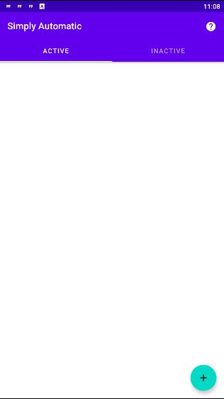 | 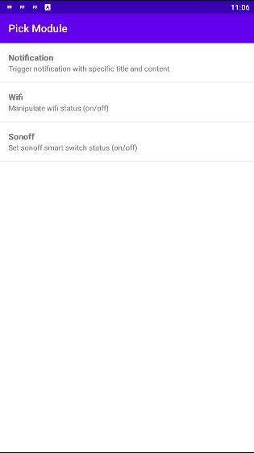 |

| External API                                                                                       | Condition list                                                                                           |
| -------------------------------------------------------------------------------------------------- | -------------------------------------------------------------------------------------------------------- |
| 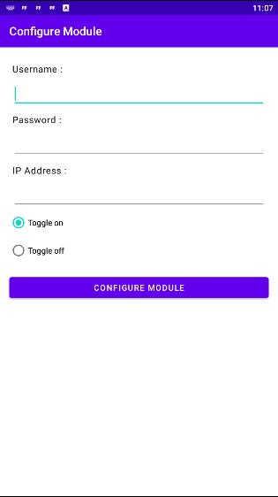 | 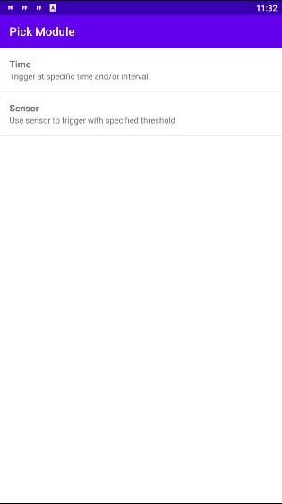 |

| Notify                                                                                 | Wifi                                                                               |
| -------------------------------------------------------------------------------------- | ---------------------------------------------------------------------------------- |
| 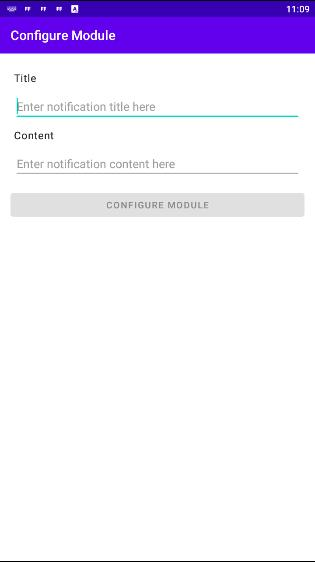 | 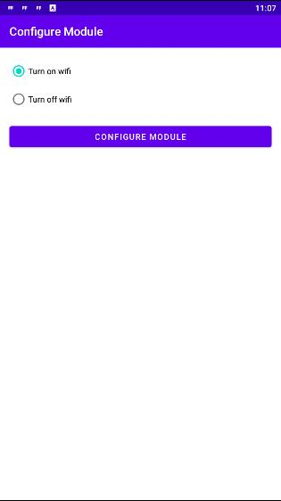 |

| Timer 1                                                                                     | Timer 2                                                                                       |
| ------------------------------------------------------------------------------------------- | --------------------------------------------------------------------------------------------- |
| 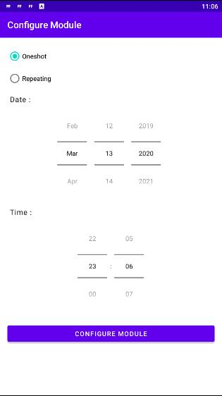 | 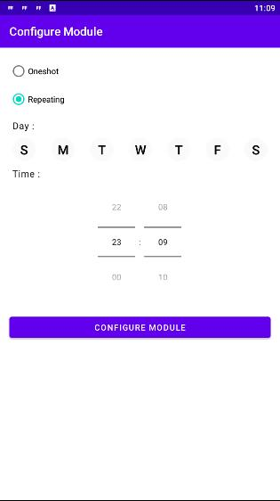 |

| Sensor                                                                                 |
| -------------------------------------------------------------------------------------- |
| 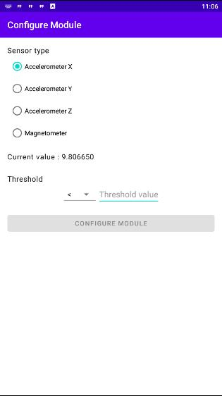 |

| Add Routine 1                                                                                    | Add Routine 2                                                                                      |
| ------------------------------------------------------------------------------------------------ | -------------------------------------------------------------------------------------------------- |
| 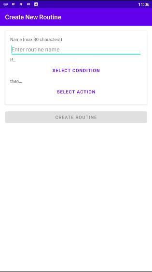 | 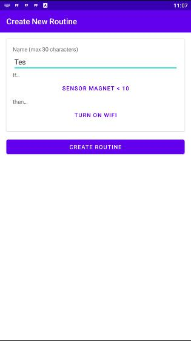 |

| Active Tab                                                                                          | Inactive Tab                                                                                            |
| --------------------------------------------------------------------------------------------------- | ------------------------------------------------------------------------------------------------------- |
| 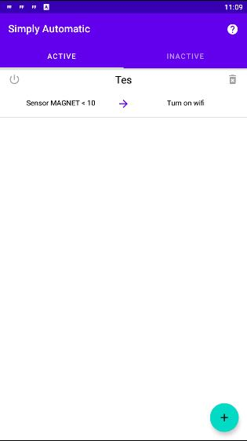 | 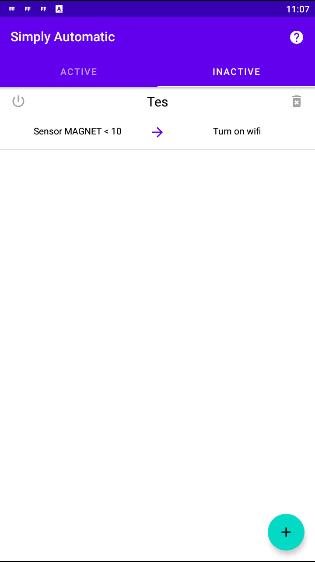 |
